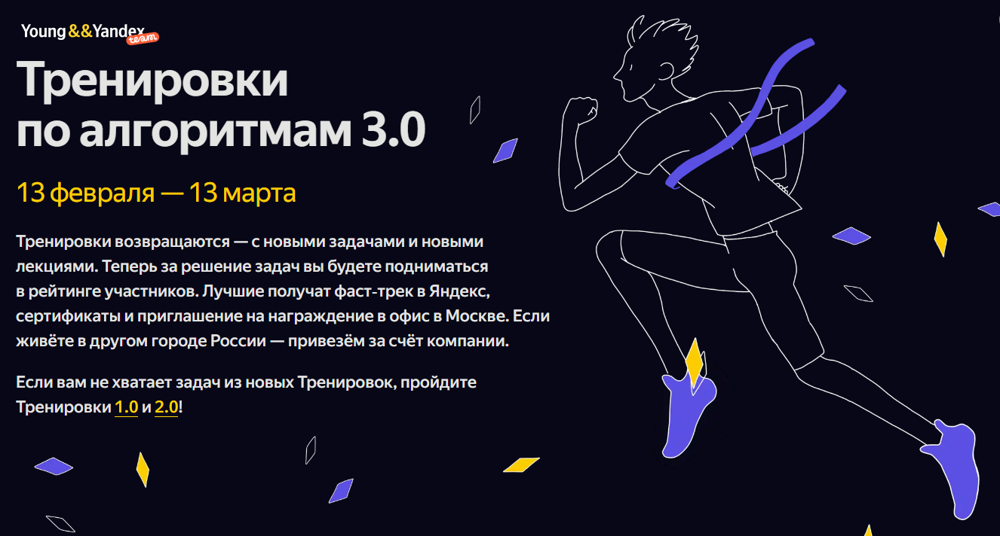

Результат моего участия в Соревнонваиях "Алгоритмы 3.0", проводимые Yandex.

Дата проведения 13 Февраля - 13 Марта.\
Дивизион B

Результат:
Решил 30 задач:

| Задачи 1 - 10 | задачи 11 - 20    | задачи 21 - 30    | задачи 31 - 40 |
|---------------|-------------------|-------------------|----------------| 
| ✅ 1. Задача   | ✅ 11. Задача | ✅ 21. Задача | ✅ 31. Задача   |
| ✅ 2. Задача   | ✅ 12. Задача | ✅ 22. Задача | 🔘 32. Задача   |
| ✅ 3. Задача   | ✅ 13. Задача | ✅ 23. Задача | 🔘 33. Задача   |
| ✅ 4. Задача   | ✅ 14. Задача | ✅ 24. Задача | 🔘 34. Задача   |
| ✅ 5. Задача   | ✅ 15. Задача | ✅ 25. Задача | 🔘 35. Задача   |
| ✅ 6. Задача   | ✅ 16. Задача | ✅ 26. Задача | 🔘 36. Задача   |
| ✅ 7. Задача   | ✅ 17. Задача | ✅ 27. Задача | 🔘 37. Задача   |
| ✅ 8. Задача   | ✅ 18. Задача | ✅ 28. Задача | 🔘 38. Задача   |
| ✅ 9. Задача   | ✅ 19. Задача | 🔘 29. Задача | 🔘 39. Задача   |
| ✅ 10. Задача  | ✅ 20. Задача | ✅ 30. Задача | 🔘 40. Задача   |

Все решения решённых задачи лежат в данном репозитории
